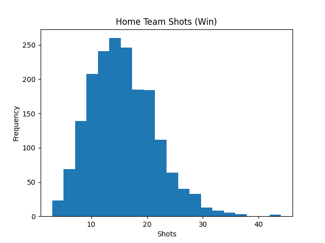

## 🇺🇸 English

### Overview
This project analyzes football match data to identify characteristics of winning teams.

### Technologies Used
- Python
- pandas
- matplotlib

### Analysis
- Classified match results (win, loss, draw)
- Visualized the distribution of shots for winning teams

### Results
- Winning teams tend to have a higher number of shots
- This suggests that offensive activity (shots) may influence match outcomes

### Visualization

